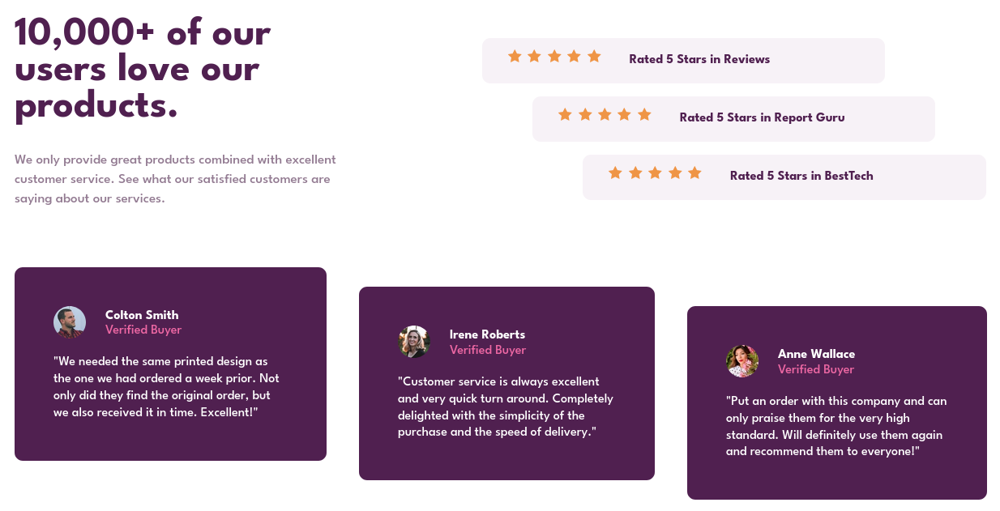

# Frontend Mentor - Social proof section solution

This is a solution to the [Social proof section challenge on Frontend Mentor](https://www.frontendmentor.io/challenges/social-proof-section-6e0qTv_bA). Frontend Mentor challenges help you improve your coding skills by building realistic projects.

## Table of contents

- [Overview](#overview)
  - [The challenge](#the-challenge)
  - [Screenshot](#screenshot)
  - [Links](#links)
- [My process](#my-process)
  - [Built with](#built-with)
  - [What I learned](#what-i-learned)
  - [Useful resources](#useful-resources)
- [Author](#author)

## Overview

### The challenge

Users should be able to:

- View the optimal layout for the section depending on their device's screen size

### Screenshot



### Links

- Solution URL: [URL](https://www.frontendmentor.io/solutions/social-proof-section-t9fvy0WMlb)
- Live Site URL: [URL](https://lisviks.github.io/social-proof-section-frontendmentor/)

## My process

### Built with

- Semantic HTML5 markup
- Flexbox
- CSS Grid
- Mobile-first workflow

### What I learned

To span item across multiple columns use `grid-column: 1 / 3`. First number is the starting line and second number is the ending line.

```html
<div class="grid">
  <div class="item-1">Item 1</div>
  <div class="item-2">Item 2</div>
  <div class="item-3">Item 3</div>
</div>
```

```css
.grid {
  display: grid;
  grid-template-columns: repeat(2, 1fr);
  gap: 10px;
  width: 500px;
}

.grid div {
  border: 2px solid red;
}

.item-3 {
  grid-column: 1 / 3;
}
```

### Useful resources

- [grid-column](https://developer.mozilla.org/en-US/docs/Web/CSS/grid-column)

## Author

- Website - [Deividas Rimkus](https://github.com/Lisviks)
- Frontend Mentor - [@Lisviks](https://www.frontendmentor.io/profile/Lisviks)
- Twitter - [@DRimkusDev](https://www.twitter.com/DRimkusDev)
